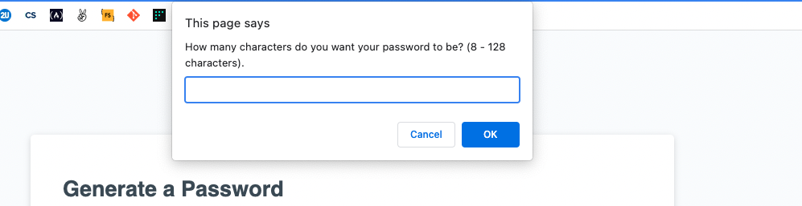
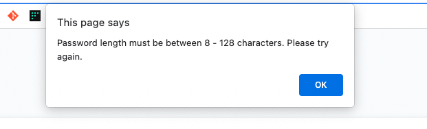
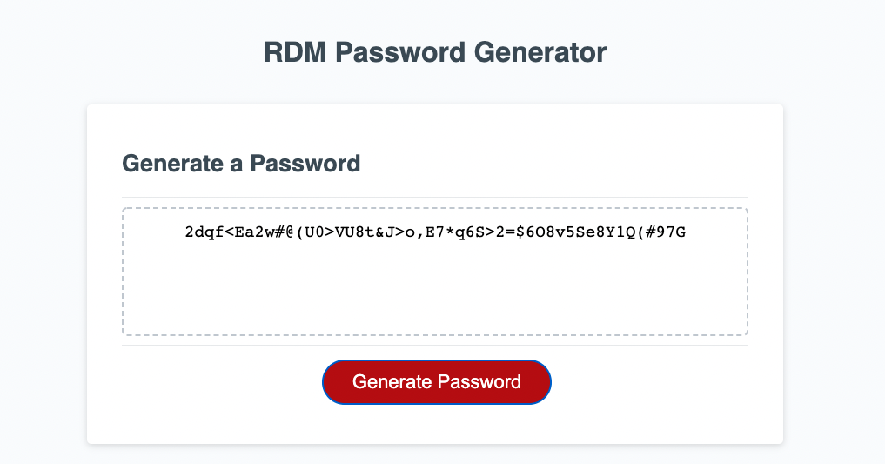

## RDM Password Generator 

## Link to Deployed Assets 
https://racheldmarron.github.io/secure-password-generator/

## Overview

This project was to create a random password generator using JavaScript. The purpose is to create strong passwords that increase security in order for employees to access sensitive data. We were given a user story of:

## User Story

```
AS AN employee with access to sensitive data
I WANT to randomly generate a password that meets certain criteria
SO THAT I can create a strong password that provides greater security
```

## Acceptance Criteria

```
GIVEN I need a new, secure password
WHEN I click the button to generate a password
THEN I am presented with a series of prompts for password criteria
WHEN prompted for password criteria
THEN I select which criteria to include in the password
WHEN prompted for the length of the password
THEN I choose a length of at least 8 characters and no more than 128 characters
WHEN asked for character types to include in the password
THEN I confirm whether or not to include lowercase, uppercase, numeric, and/or special characters
WHEN I answer each prompt
THEN my input should be validated and at least one character type should be selected
WHEN all prompts are answered
THEN a password is generated that matches the selected criteria
WHEN the password is generated
THEN the password is either displayed in an alert or written to the page
```

## How This Was Acheieved
<ul><li>By using JavaScript, I was able to pass all acceptance criteria. I created variables for password requirements (uppercase, lowercase, number, special characters).</li>
<li>I then was able to create a function to generate the password.</li>
<li>Along the way, it asks the employee criteria on which requirements they would like to include and how many characters they want the password to be.</li>
<li>In case the employee chose no requirements, or the incorrect number of characters (minimum or maximum), the employee would receive an error message to try again.</li>
<li>Once all criteria were accepted, the random password would generate to the employee's specifications in the box on the page.</li></ul>

## Visual Representations






- - -
© 2021 Rachel Delaney Marron, Inc. All Rights Reserved.